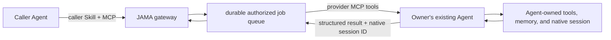

# Agent Integration Guide

## One middleware contract, not one adapter per Agent

JAMA does not need to understand how every Agent plans, stores memory, invokes tools, or
resumes work. An Agent that can use MCP and follow a Skill can become a local work provider
through the same durable contract. Vendor-specific adapters remain compatibility bridges for
Agents that cannot run that contract.



The boundary is deliberate:

- JAMA owns identity, pairing, Owner consent, grants, durable delivery, lifecycle, egress,
  writeback review, and audit.
- The connected Agent owns planning, model choice, tool use, internal memory, and its native
  session implementation.
- The Agent receives only the authorized job envelope. JAMA does not inject itself into the
  Agent's private control loop.
- Every Agent installation keeps its own configuration and JAMA provider credential. JAMA
  never edits vendor configuration files.

## Connect a provider Agent

1. Build JAMA and start the gateway with the provider adapter:

   ```powershell
   npm install
   npm run build
   $env:JAMAI_ADAPTER="provider"
   npm run dev:node
   ```

2. Configure the repository's `just_ask_my_ai` STDIO MCP server in the Agent. The project
   scoped Codex configuration is an example; use the Agent's normal MCP configuration
   mechanism.
3. Give the Agent [the JAMA Provider Skill](../skills/jama-provider/SKILL.md). The Skill tells
   it how to register, preserve credentials, claim work, renew leases, resume native sessions,
   and return contextual answers.
4. The Agent calls `register_local_agent`. First registration returns a one-time credential;
   the Agent stores it in its private local configuration.
5. Open the Owner Hub at `http://127.0.0.1:43121/chat`. Confirm the pending Agent only after
   checking its name and declared capabilities.
6. Keep the Agent's provider loop running. It long-polls JAMA and remains idle until an
   Owner-authorized request is available.

Provider registration is intentionally two-sided: an Agent can request a connection, but
only the local Owner can activate it. Suspending the Agent invalidates its ability to claim
new jobs and requeues its leased work.

## Persistent External Session behavior

Each completed provider turn may return the Agent's native `sessionId`. JAMA stores this
mapping in SQLite against the External Session. A later turn includes it as
`resumeSessionId`, including after the JAMA gateway and MCP provider reconnect.
JAMA pins later turns to the provider Agent that created that native session, so a second
locally connected Agent cannot claim the job or receive another Agent's session ID.

Jobs and leases are durable. If an Agent or gateway stops while work is claimed, the lease
expires and the job becomes claimable again. The Agent must avoid repeating irreversible
side effects after it loses a lease. When native session resume is unavailable, it must say
that it performed degraded rehydration instead of pretending continuity.

JAMA persists the External Thread independently of the Agent's native session. This gives
the audit and consent layer durable history without importing the Agent's unrelated memory.

## Capability and trust semantics

Initial capability declarations are self-reported. Owner activation upgrades ordinary
isolation claims to `owner-attested`; it does not turn them into an OS security boundary.
Use `enforced` only when the Agent host actually supplies and records an enforced isolation
boundary. JAMA fails closed for External Sessions unless an active provider declares isolated
sessions, native resume, and structured contextual output.

## Caller Agents

Install [the JAMA Caller Skill](../skills/jama-caller/SKILL.md) in an Agent that should contact
other people through JAMA. It uses the existing MCP discovery, A2A, Group, External Session,
egress, and writeback tools. Parallelism and result synthesis stay in the caller Agent; JAMA
routes and audits bounded requests rather than becoming a team orchestrator.

## Conformance test

Run:

```powershell
npm run test:provider-e2e
```

The test registers a provider, confirms Owner activation, opens and approves a guest External
Session, completes a first turn with a native session ID, restarts the gateway, reconnects the
provider, verifies that the second turn receives the same native session ID, and completes it.

Passing this test proves the JAMA-side contract and restart mapping. It does not prove that a
specific third-party Agent truthfully enforces every capability it advertises; that remains
part of the Owner's local trust decision.
