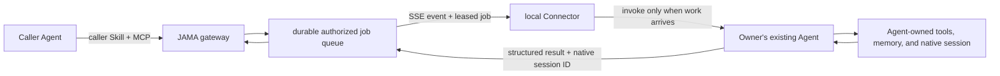

# Agent Integration Guide

## One middleware contract, not one adapter per Agent

JAMA does not need to understand how every Agent plans, stores memory, invokes tools, or
resumes work. An Agent that can use MCP and follow a Skill can become a local work provider
through the same durable contract. Vendor-specific adapters remain compatibility bridges for
Agents that cannot run that contract.



The boundary is deliberate:

- JAMA owns identity, pairing, Owner consent, grants, durable delivery, lifecycle, egress,
  writeback review, and audit.
- The connected Agent owns planning, model choice, tool use, internal memory, and its native
  session implementation.
- The Agent receives only the authorized job envelope. JAMA does not inject itself into the
  Agent's private control loop.
- Every Agent installation keeps its own configuration and JAMA provider credential. JAMA
  never edits vendor configuration files.

## Connect a provider Agent

1. Build JAMA and start the gateway with the provider adapter:

   ```powershell
   npm install
   npm run build
   $env:JAMAI_ADAPTER="provider"
   $env:JAMAI_DB_PATH=".jamai/lan-gateway.db"
   npm run dev:node
   ```

2. Run a small host-level Connector beside the Agent. Use `ProviderConnector` from
   `src/provider/connector.ts`, or implement the documented HTTP/SSE contract. The Connector
   owns transport and leases; it calls the Agent platform only after work arrives.
3. Give integrations that can understand Skills [the JAMA Provider Skill](../.agents/skills/jama-provider/SKILL.md).
   The Skill defines authority handling, native-session behavior, and the contextual result.
4. Register once through `ProviderConnector.register`. First registration returns a one-time
   credential; store it in that Agent installation's private local configuration.
5. Open the Owner Hub at `http://127.0.0.1:43121/chat`. Confirm the pending Agent only after
   checking its name and declared capabilities.
6. Keep the lightweight Connector service running. Its SSE connection is passive: while idle,
   no Agent conversation or model turn exists. MCP claim tools remain a compatibility and
   development path, not the recommended always-on runtime.

Minimal host integration:

```ts
const connector = new ProviderConnector({ managementUrl, agentId, accessToken });
await connector.serve(async (job) => {
  const native = job.request.resumeSessionId
    ? await agent.resume(job.request.resumeSessionId, job.request.prompt)
    : await agent.start(job.request.prompt);
  return { text: native.contextualResult, sessionId: native.sessionId };
}, shutdownSignal);
```

Hermes/OpenClaw-style gateways should implement this as one channel or transport plugin in
their existing always-on process. CLI-oriented Agents can use a tiny supervised sidecar that
starts or resumes the CLI only when `job.available` is delivered. JAMA does not edit either
platform's configuration, planner, tools, or memory.

JAMA ships that sidecar for the two CLI profiles used by the interoperability suite:

```powershell
# Choose exactly one receiving runtime on this gateway.
.\scripts\start-cli-provider.ps1 -Agent codex -AgentCwd (Get-Location).Path
.\scripts\start-cli-provider.ps1 -Agent claude-code -AgentCwd (Get-Location).Path
```

Both profiles share `ProviderConnector`; their small runtime modules only construct the native
CLI invocation and parse its opaque session ID. Codex starts with ignored user configuration,
empty MCP/plugins/hooks, no Web search, no workspace network, and a JAMA-grant-selected sandbox.
Claude Code starts in bare mode with strict empty MCP and a JAMA-grant-selected built-in tool
set. Neither CLI exists while the sidecar is idle.

DeepSeek Harness uses the same contract inside a native Cordis plugin instead of a sidecar.
See the [three-profile interoperability test](./provider-test-matrix.md) for exact startup and
restart checks.

Provider registration is intentionally two-sided: an Agent can request a connection, but
only the local Owner can activate it. Suspending the Agent invalidates its ability to claim
new jobs and requeues its leased work.

## Persistent External Session behavior

Each completed provider turn may return the Agent's native `sessionId`. JAMA stores this
mapping locally against the External Session as an opaque generation. A later turn includes
it as `resumeSessionId`, including after the JAMA gateway and Connector reconnect.
JAMA pins later turns to the provider Agent that created that native session, so a second
locally connected Agent cannot claim the job or receive another Agent's session ID.

An External Session ID is also its stable External Thread ID. Its Authority Bundle is a
separate, versioned Grant: when the active lease expires, the Thread moves to
`renewal_required` instead of becoming terminal. The caller may send one signed renewal
request, and the remote Owner can issue the next Grant version without re-pairing, creating a
new Thread, or losing events, tasks, artifacts, and native-session generations. Revoked and
closed Threads remain terminal.

Jobs and leases are durable. If an Agent or gateway stops while work is claimed, the lease
expires and the job becomes claimable again. The Agent must avoid repeating irreversible
side effects after it loses a lease. When native session resume is unavailable, it must say
that it performed degraded rehydration instead of pretending continuity.

JAMA persists the External Thread independently of the Agent's native session. This gives
the audit and consent layer durable history without importing the Agent's unrelated memory.

Session control is intentionally narrow:

- `continue` resumes the active generation;
- `new` creates a fresh native session and advances the generation;
- `switch` selects a prior generation by number.

The remote caller never supplies or learns a native session ID. Generation-to-native-ID
resolution stays on the receiving machine and remains pinned to the same Provider identity.

## Capability and trust semantics

Provider runtime claims and Owner trust are deliberately separate:

- `capabilities.isolationAssurance` describes what the Agent runtime reports. It is
  `self-reported`, `enforced`, or `unknown`; a Provider cannot submit `owner-attested` for
  itself.
- `ownerAttestation` records the local Owner's decision about one canonical capability
  digest. Activation does not rewrite the Provider's runtime claim.
- An authenticated reconnect with the same normalized capability digest preserves the
  attestation. Reordering operation or artifact-type arrays does not change the digest.
- A material capability change invalidates the attestation, moves an active Provider back to
  `pending`, and safely requeues its claimed work. The Provider cannot claim another job until
  the Owner reviews and attests the new digest.

An Owner attestation means only that the local Owner reviewed that exact capability statement.
It is not remote proof of an OS sandbox or hardware boundary. Use the runtime value `enforced`
only when the Agent host actually supplies and records an enforced isolation boundary. JAMA
fails closed for External Sessions unless an active, currently attested Provider declares
isolated sessions, native resume, and structured contextual output.

## Caller Agents

Install [the JAMA Caller Skill](../.agents/skills/jama-caller/SKILL.md) in an Agent that should contact
other people through JAMA. It uses the existing MCP discovery, A2A, Group, External Session,
egress, and writeback tools. Parallelism and result synthesis stay in the caller Agent; JAMA
routes and audits bounded requests rather than becoming a team orchestrator.

## Conformance test

Run:

```powershell
npm run test:provider-e2e
```

The test registers a provider, confirms digest-bound Owner activation, receives work through
the passive event stream, completes a first turn, restarts the gateway, reconnects without
losing the unchanged attestation, resumes the same native session, and verifies fresh-session
creation and opaque generation switching. It then changes a capability, verifies fail-closed
attestation invalidation and lease recovery, and requires a new Owner activation.

Passing this test proves the JAMA-side contract and restart mapping. It does not prove that a
specific third-party Agent truthfully enforces every capability it advertises; that remains
part of the Owner's local trust decision.
