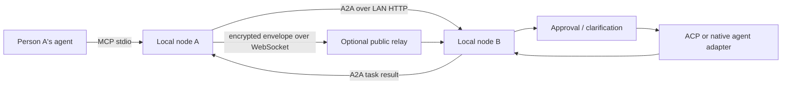

# JustAskMyAI architecture

## Decision

Use existing protocols at the boundaries:

- **MCP** is the interface installed into Codex, Claude Code, Hermes, OpenClaw, and other hosts.
- **A2A v1.0** is the agent-to-agent task, message, artifact, streaming, cancellation, and multi-turn protocol.
- **ACP** is the preferred local runtime adapter when an agent exposes it.
- Vendor-native headless/API adapters are compatibility fallbacks, not the core protocol.

## Topology

The relay is deliberately dumb: presence, rendezvous, groups, and opaque frame routing. Agent cards, policy, approvals, credentials, agent sessions, and audit records remain at the edge.

## What is reused from HADFlow

- node and capability registration
- approval ticket semantics
- execution event/audit ledger
- deploy modes and outbound node connection

Do not reuse HADFlow's workflow/OKR/industrial-device domain, central Brain routing, or hard-coded `prompt -> CLI stdout` agent abstraction.

## Security defaults

- Incoming asks require human approval by default.
- A node only exposes declared Agent Card skills.
- Process adapters never use a shell and never interpolate remote input into a command string.
- Public relay payloads must become end-to-end encrypted before production.
- Pairing, signed Agent Cards, replay protection, rate limits, and local encrypted storage are release blockers.

## Next adapters

1. Persist ACP sessions by A2A `contextId` (the MVP ACP adapter is one-shot).
2. Claude Code adapter: official `claude-agent-acp`, Agent SDK, or print mode with `--permission-prompt-tool`.
3. OpenClaw adapter: Gateway-backed `openclaw agent --json` with stable session keys.
4. Codex adapter: official `codex-acp`, with MCP permissions left intact.
5. Generic OpenAI-compatible Responses/Chat adapter.

## MVP acceptance path

1. Start two nodes with different ports and `JAMAI_POLICY=auto`.
2. Add the second node manually or discover it over mDNS.
3. Run the MCP server and call `list_remote_ais`.
4. Call `ask_remote_ai`; receive an A2A task and artifact.
5. Repeat with `always_ask`; observe `input-required`, approve locally, then continue with the approval ID.

## Collaboration tools

- `ask_remote_ai`: contextual Q&A only.
- `delegate_remote_task`: one remote computer executes a concrete role and objective.
- `collaborate_with_ais`: several remote assignments execute concurrently; the caller's AI is the coordinator.

Code work uses separate Git branches/worktrees. The bridge transports task
context and work reports; Git transports reviewed source changes.
