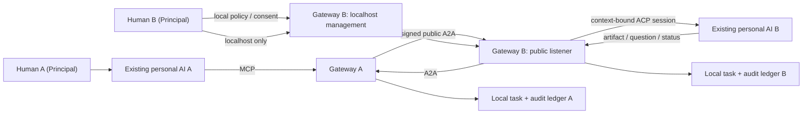

# Architecture

## Product boundary

JustAskMyAI is a Personal AI Gateway and Delegation Protocol:

```text
identity + consent + delegation + audit
```

It connects existing personal Agents. It does not schedule their internal work, merge their
plans, or become another multi-Agent framework.

## Human position

The human is the Principal, not a worker inserted into an Agent loop.

- Before: select workspace, peer trust, disclosed context, and delegation bounds.
- During: approve a concrete boundary-crossing request or provide clarification.
- After: inspect the responsibility chain, revoke authority, and hold actions accountable.

## Protocol boundaries

- MCP: installation surface for Codex, Claude Code, Hermes, OpenClaw, and other hosts.
- A2A v1.0: cross-gateway task, message, artifact, continuation, and cancellation protocol.
- ACP: preferred adapter to the owner's existing local Agent.
- Native headless/API adapters: compatibility fallback, not a new Agent runtime.



## Delegation envelope

Every request has a mode (`ask`, `delegate`, `review`, or `execute`), objective, disclosed
context, acceptance criteria, expected result, and caller-declared authority. The receiving
owner's policy always wins.

`continue_remote_task` uses the same A2A task and context. During one gateway process
lifetime, that context maps to the same local ACP process and session. Restart recovery is
not implemented.

## Consent

An approval is not a reusable boolean. It is bound to:

```text
peerId + taskId + contextId + requestHash
```

It expires and is consumed once. Changing the objective, context, authority, or task makes
the previous approval invalid.

## Identity and request integrity

Each gateway creates a local Ed25519 keypair. Its `peerId` is derived from the public-key
fingerprint. Send, continue, get, and cancel actions bind the issuer, audience, action,
message/task/context identity, normalized payload digest, five-minute timestamp, and one-time
nonce. Requests are rejected on forwarding, tampering, or replay. A request is accepted only
after the local owner has explicitly paired the remote Agent Card and key.

## Network boundary

The public listener exposes only the Agent Card and signed A2A protocol. The management
listener binds to `127.0.0.1` by default and owns approvals, peer registration, local task
inspection, policy state, and audit access.

## Tool policy enforcement

Human-approved scopes are intersected with the local `JAMAI_ACP_ALLOW_TOOLS` policy and the
actual ACP tool name/kind. A tool permission is allowed only when all gates permit it. Each
decision becomes an audit event.

## Audit

Audit records the responsibility chain, not private chain-of-thought:

- principals, Agents, peers, task/context/delegation IDs
- request and artifact digests
- approval and policy decisions
- lifecycle events and timestamps
- redacted operational metadata

Events form a local SHA-256 integrity chain. The localhost-only
`GET /api/audit/verify` endpoint verifies it. Content modes are `metadata`, `redacted`
(default), and `full-local`. A database owner can rebuild the chain, so this is not yet
non-repudiable audit; signed external checkpoints are planned.

HADFlow's useful idea was its separate run/event/tool/policy-decision ledger. This project
keeps that audit discipline but replaces HAD's central orchestration semantics with bilateral
personal delegation.

## Security status

LAN testing is supported now. Signed requests and replay protection are implemented.
Untrusted-public-network use is not production-ready until end-to-end relay encryption,
identity revocation/key rotation, and rate limits are implemented.

The relay remains optional and should only route opaque frames. Identity, policy, credentials,
Agent sessions, artifacts, and audit records stay at the edge.

The A2A Task Store and gateway ledger are both SQLite-backed. ACP session IDs are recorded
for evidence and in-process continuity, not restart resumption.
