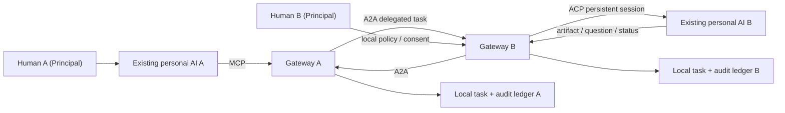

# Architecture

## Product boundary

JustAskMyAI is a Personal AI Gateway and Delegation Protocol:

```text
identity + consent + delegation + audit
```

It connects existing personal Agents. It does not schedule their internal work, merge their
plans, or become another multi-Agent framework.

## Human position

The human is the Principal, not a worker inserted into an Agent loop.

- Before: select workspace, peer trust, disclosed context, and delegation bounds.
- During: approve a concrete boundary-crossing request or provide clarification.
- After: inspect the responsibility chain, revoke authority, and hold actions accountable.

## Protocol boundaries

- MCP: installation surface for Codex, Claude Code, Hermes, OpenClaw, and other hosts.
- A2A v1.0: cross-gateway task, message, artifact, continuation, and cancellation protocol.
- ACP: preferred adapter to the owner's existing local Agent and its persistent session.
- Native headless/API adapters: compatibility fallback, not a new Agent runtime.



## Delegation envelope

Every request has a mode (`ask`, `delegate`, `review`, or `execute`), objective, disclosed
context, acceptance criteria, expected result, and caller-declared authority. The receiving
owner's policy always wins.

`continue_remote_task` uses the same A2A task and context. The gateway maps that context to
the same local ACP session so the remote Agent keeps its own memory.

## Consent

An approval is not a reusable boolean. It is bound to:

```text
peerId + taskId + contextId + requestHash
```

It expires and is consumed once. Changing the objective, context, authority, or task makes
the previous approval invalid.

## Identity and request integrity

Each gateway creates a local Ed25519 keypair. Its `peerId` is derived from the public-key
fingerprint. Every delegation signs the normalized envelope and body, includes a five-minute
timestamp and one-time nonce, and is rejected on tampering or replay. A previously observed
peer ID cannot silently change keys.

## Audit

Audit records the responsibility chain, not private chain-of-thought:

- principals, Agents, peers, task/context/delegation IDs
- request and artifact digests
- approval and policy decisions
- lifecycle events and timestamps
- redacted operational metadata

Events form a local SHA-256 hash chain. `GET /api/audit/verify` verifies it. Content modes
are `metadata`, `redacted` (default), and `full-local`.

HADFlow's useful idea was its separate run/event/tool/policy-decision ledger. This project
keeps that audit discipline but replaces HAD's central orchestration semantics with bilateral
personal delegation.

## Security status

LAN testing is supported now. Signed requests and replay protection are implemented.
Untrusted-public-network use is not production-ready until explicit peer pairing, end-to-end
relay encryption, identity revocation, and rate limits are implemented.

The relay remains optional and should only route opaque frames. Identity, policy, credentials,
Agent sessions, artifacts, and audit records stay at the edge.
