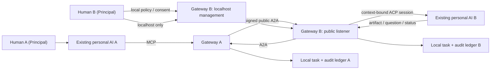

# Architecture

## Product boundary

JustAskMyAI is a Personal AI Gateway and Delegation Protocol:

```text
identity + consent + delegation + audit
```

It connects existing personal Agents. It does not schedule their internal work, merge their
plans, or become another multi-Agent framework.

The optional Group Layer adds persistent membership, roles, threads, routing constraints,
and signed receipts. It still delegates one bounded request to one existing remote Agent.

## Human position

The human is the Principal, not a worker inserted into an Agent loop.

- Before: select workspace, peer trust, disclosed context, and delegation bounds.
- During: approve a concrete boundary-crossing request or provide clarification.
- After: inspect the responsibility chain, revoke authority, and hold actions accountable.

## Protocol boundaries

- MCP: installation surface for Codex, Claude Code, Hermes, OpenClaw, and other hosts.
- A2A v1.0: cross-gateway task, message, artifact, continuation, and cancellation protocol.
- ACP: preferred adapter to the owner's existing local Agent.
- Native headless/API adapters: compatibility fallback, not a new Agent runtime.



## Delegation envelope

Every request has a mode (`ask`, `delegate`, `review`, or `execute`), objective, disclosed
context, acceptance criteria, expected result, and caller-declared authority. The receiving
owner's policy always wins.

`continue_remote_task` uses the same A2A task and context. During one gateway process
lifetime, that context maps to the same local ACP process and session. Restart recovery is
not implemented.

## Consent

An approval is not a reusable boolean. It is bound to:

```text
peerId + taskId + contextId + requestHash
```

It expires and is consumed once. Changing the objective, context, authority, or task makes
the previous approval invalid.

A Group Envelope is included in both the request signature and `requestHash`. Changing its
group, thread, sender, target, operation, policy version, or membership version also
invalidates the request and any approval issued for it.

## Group Layer

Each gateway keeps a local copy of a workgroup manifest:

```text
workgroup + role policy + members + policy version + membership version
```

The manifest is not trusted merely because a Human imported it. It is signed by a current
Owner/Admin and linked to the previous manifest digest. Every active member also carries a
Gateway-signed Human Principal, Agent, and Gateway sponsorship binding.

Receivers request signed updates from the Owner before every Group operation. Updates advance
one governance version, and a manifest lease bounds offline stale-state acceptance. Learned
removals persist in a denylist and apply to task creation, continuation, reads, and
cancellation.

Group tasks carry a signed envelope containing the workgroup version, collaboration thread,
sender member, target member or role, and operation. The receiver validates the envelope
against its local manifest and the already-authenticated peer identity. Stale manifests,
inactive members, unauthorized roles, wrong targets, and task broadcasts are rejected.

Role routing is intentionally deterministic: `delegate_group_task` accepts a member target
or a role that resolves to exactly one active remote member. It does not fan out, schedule a
team, merge plans, or resolve Agent conflicts.

Object context uses field selection, a redaction declaration, a sender Human approval, and a
disclosure digest. The receiver rejects undeclared or changed fields.

On completion, the receiving gateway signs a v2 receipt over governance versions, requester,
responder, request, accepted authority, disclosure, approval, tool-decision, and artifact
digests. The sender verifies the Ed25519 proof against its pinned peer key before storing it.

## Identity and request integrity

Each gateway creates a local Ed25519 keypair. Its `peerId` is derived from the public-key
fingerprint. Send, continue, get, and cancel actions bind the issuer, audience, action,
message/task/context identity, normalized payload digest, five-minute timestamp, and one-time
nonce. Requests are rejected on forwarding, tampering, or replay. A request is accepted only
after the local owner has explicitly pinned the remote Agent Card and key.

The JustAskMyAI Agent Card extension is required. Clients must declare the extension on every
A2A call. This is owner-approved key pinning, not proof of real-world identity: the initial
HTTP Agent Card fetch can still be attacked. Short pairing codes, QR comparison, or
organization-issued identities remain future work. The wire contract is documented in
[Delegation Extension v1](./protocol-v1.md).

## Network boundary

The public listener exposes only the Agent Card and signed A2A protocol. The management
listener binds to `127.0.0.1` by default and owns approvals, peer registration, local task
inspection, policy state, and audit access.

## Tool policy enforcement

The owner can reduce requested scopes and add explicit denies during approval. Effective
authority is:

```text
sender sponsorship
INTERSECT group role grant
INTERSECT task request
INTERSECT receiver Human approval
INTERSECT local owner policy
INTERSECT actual ACP tool name/kind
MINUS all explicit denials
```

Denied scopes override wildcard allows. `run-tests` applies only to a dedicated test-tool
name, never to a generic terminal. Every permission decision is committed to the audit ledger
before `allow_once` or `reject_once` is returned; audit failure denies the tool.

## Audit

Audit records the responsibility chain, not private chain-of-thought:

- principals, Agents, peers, task/context/delegation IDs
- request and artifact digests
- approval and policy decisions
- lifecycle events and timestamps
- redacted operational metadata

Events form a local SHA-256 integrity chain. Group completion additionally produces a
remote-gateway-signed receipt. The localhost-only
`GET /api/audit/verify` endpoint verifies it. Content modes are `metadata`, `redacted`
(default), and `full-local`. A database owner can rebuild the local chain, so independently
anchored audit checkpoints remain future work.

HADFlow's useful idea was its separate run/event/tool/policy-decision ledger. This project
keeps that audit discipline but replaces HAD's central orchestration semantics with bilateral
personal delegation.

## Security status

LAN testing is supported now. Signed requests and replay protection are implemented.
Untrusted-public-network use is not production-ready until end-to-end relay encryption,
identity revocation/key rotation, and rate limits are implemented.

The relay remains optional and should only route opaque frames. Identity, policy, credentials,
Agent sessions, artifacts, and audit records stay at the edge.

The A2A Task Store and gateway ledger are both SQLite-backed. ACP session IDs are recorded
for evidence and in-process continuity, not restart resumption.
