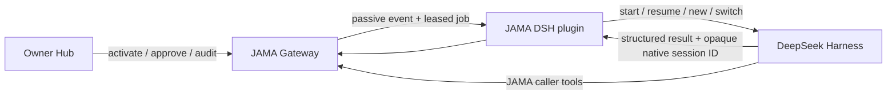

# DeepSeek Harness Integration and Launch Plan

Status: Milestone 1 verified; Milestone 2 implementation in progress

Baseline: DeepSeek Harness `0.1.0-rc.6` Developer Preview

JAMA branch: `codex/deepseek-harness-plugin`

Verified on 2026-08-17: the local tarball installs into a clean DSH Web profile, reports no
peer dependency issues, composes as its own bundle layer, boots the Web surface, and returns
HTTP 200. This is a compatibility smoke test, not the cross-machine release E2E.

## Product position

DeepSeek Harness (DSH) is JAMA's first native plugin target, not a new vendor adapter.
DSH keeps ownership of its model, agent loop, tools, memory, hooks, and native sessions.
JAMA contributes the boundary between people and their Agents:

- peer identity and pairing;
- Owner consent and scoped authority;
- passive delivery of authorized work;
- persistent External Session routing;
- egress review, writeback review, and audit.

The integration must remain thin enough that the same JAMA Provider contract continues to
serve Codex, Claude Code, WorkBuddy, Hermes, OpenClaw, and future Agent hosts.

## Why DSH now

DSH explicitly makes capabilities replaceable Cordis plugins and recommends changing plugin
composition instead of editing the agent loop. That is a direct match for JAMA's middleware
boundary. It also gives JAMA a timely, concrete demonstration: two independently owned DSH
Agents can collaborate without sharing their private configuration, memory, or credentials.

DSH is still a Developer Preview and does not promise compatibility. The first release will
therefore pin one tested DSH release and keep all DSH-specific code behind a small package.
The durable JAMA protocol and Provider Connector will not depend on DSH internals.

## Release shape

The initial deliverable is one installable DSH plugin package with two independently enabled
capabilities:

1. **Provider** — maintain the lightweight authenticated JAMA event connection, wake DSH only
   when an authorized job arrives, start/resume the correct native DSH session, and return a
   structured contextual result.
2. **Caller** — expose JAMA discovery, ask, delegate, External Session, status, and cancellation
   operations as DSH-native tools. Coordination and result synthesis stay in DSH.

Configuration is local to the DSH installation. It contains the JAMA management endpoint,
Agent identity, and a reference to a locally protected credential. Secrets must not be stored
in a committed `cordis.yml`, preset, session transcript, or model prompt.

## Delivery plan

### Milestone 1 — loadable compatibility spike (day 0–1)

- Pin and test the current DSH Developer Preview on its supported Node runtime.
- Create a minimal external Cordis plugin that loads without patching DSH.
- Record the smallest stable seams for lifecycle, tool registration, interaction, session
  creation, and session resume.
- Add a compatibility manifest so an unsupported DSH version fails with a useful message.

Exit criterion: a clean DSH installation loads and unloads the plugin, and JAMA-specific code
is confined to the integration package.

### Milestone 2 — passive Provider closed loop (day 1–3)

- Embed the existing `ProviderConnector`; do not implement model-driven polling.
- Support one-time registration, Owner activation, reconnect with backoff, lease renewal,
  progress, completion, and safe failure.
- Persist the DSH-native session mapping through the JAMA Provider contract.
- Map JAMA session intentions to DSH: `continue`, `new`, and `switch`.
- Surface connection and job state without placing access tokens in logs or conversations.

Exit criterion: a remote Agent opens an External Session, completes turn 1, both JAMA and DSH
restart, turn 2 resumes the same native session, then `new` and `switch` select the expected
generations. Idle operation creates no model turns.

### Milestone 3 — native Caller tools and human UX (day 3–5)

- Register a deliberately small JAMA tool group for discovery, ask/delegate, session control,
  status, and cancellation.
- Return human-readable peer names, task state, approval state, and results; hide internal IDs
  unless diagnostic detail is requested.
- Deep-link pending consent and egress decisions to the local Owner Hub where possible.
- Preserve DSH's own planning and multi-Agent behavior; do not add a JAMA orchestrator.

Exit criterion: a new user can pair, delegate, approve, receive a result, continue or replace a
session, and inspect the audit trail without copying IDs or running JAMA management commands.

### Milestone 4 — public preview (day 5–7)

- Publish an install guide, pinned compatibility table, sample local configuration, and a
  two-computer troubleshooting path.
- Record a short demo of two owners' DSH Agents completing a consent-bound persistent session.
- Publish the package and tag the release as preview.
- Add the GitHub `dsh-plugin` topic only when the package is installable, as requested by the
  DSH project for plugin discovery.
- Announce the architectural result, not just compatibility: JAMA gives plugin-based Agents a
  cross-owner identity, consent, session, and audit layer.

Exit criterion: a clean-machine installation follows the public guide successfully, the E2E
test is reproducible, and every README claim links to a passing test or documented limitation.

## Compatibility and test matrix

| Path | Required scenario | Release gate |
| --- | --- | --- |
| DSH provider | passive receive, approval, lease recovery | automated + two-machine E2E |
| DSH session | restart resume, `new`, `switch` | automated + two-machine E2E |
| DSH caller | discover, ask/delegate, status, cancel | automated E2E |
| DSH to Codex | persistent External Session across owners | two-machine E2E |
| Codex to DSH | persistent External Session across owners | two-machine E2E |
| Security | credential redaction, grant ceilings, egress hold | automated negative tests |
| Compatibility | pinned DSH version and unsupported-version error | clean install test |

## Release boundaries

The preview will not claim a stable DSH plugin API, public-internet production readiness,
semantic leak prevention, or control over DSH's internal tool execution. JAMA enforces only
the cross-owner authority and data boundaries it can observe. DSH upgrades are tested before
the compatibility pin moves.

## Exposure message

Use one consistent description across the README, release notes, demo, and social posts:

> JAMA is the identity, consent, persistent-session, and audit plugin for collaboration
> between independently owned AI Agents. DeepSeek Harness is its first native plugin target.

This message differentiates JAMA from model routers and multi-Agent orchestrators while still
matching the terms people will use to discover DSH plugins.

## DSH references

- [DeepSeek Harness official repository](https://github.com/deepseek-ai/deepseek-harness)
- [Official architecture and contribution guide](https://github.com/deepseek-ai/deepseek-harness/blob/master/AGENTS.md)
- [Official `dsh-plugin` discovery topic](https://github.com/topics/dsh-plugin)
